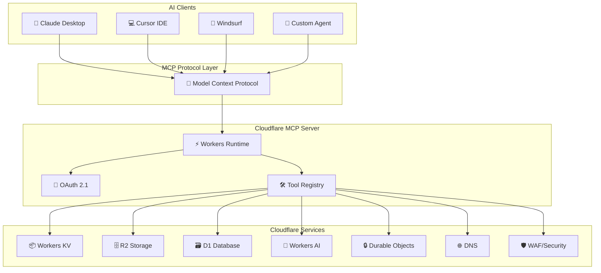
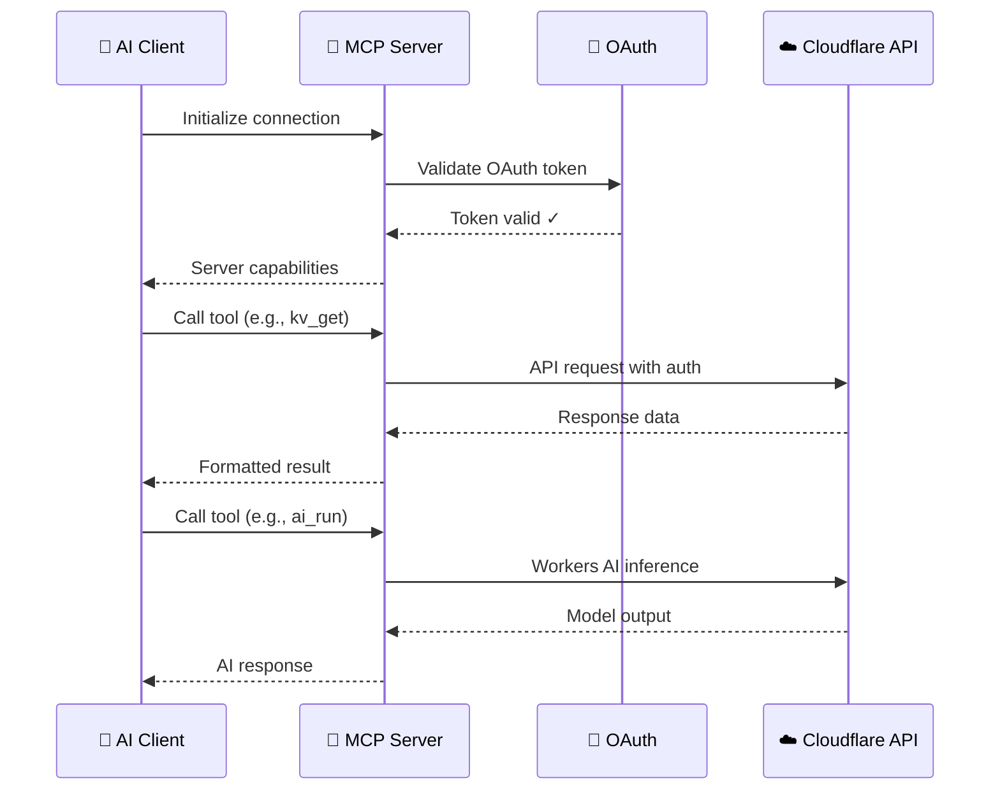
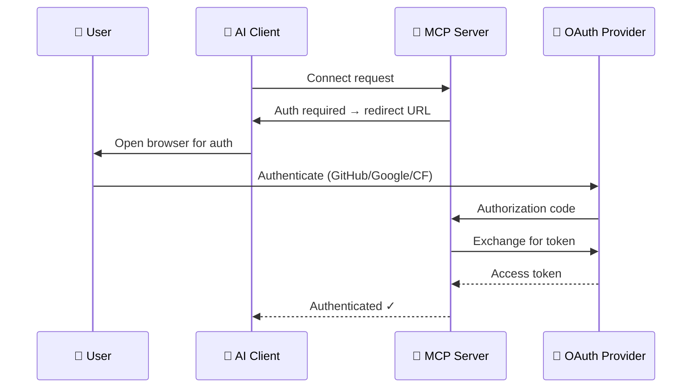

# 🤖 Cloudflare MCP Integration Guide

> *Connect AI assistants directly to Cloudflare services using the Model Context Protocol (MCP).*

MCP is an open standard — think of it as a **"USB-C port for AI"** — that enables large language models and AI agents to securely access external tools, APIs, and data sources through a universal protocol.

---

## 🗺️ Architecture Overview



---

## 🚀 Quick Start

### Prerequisites

- Node.js 18+
- Cloudflare account ([sign up free](https://dash.cloudflare.com/sign-up))
- Wrangler CLI: `npm i -g wrangler`

### 1. Clone the MCP Server

```bash
git clone https://github.com/cloudflare/mcp-server-cloudflare.git
cd mcp-server-cloudflare
npm install
```

### 2. Configure Authentication

```bash
wrangler login  # Authenticate with Cloudflare
```

### 3. Deploy to Workers

```bash
npx wrangler deploy
```

### 4. Connect Your AI Client

Add the server URL to your MCP client configuration:

```json
{
  "mcpServers": {
    "cloudflare": {
      "url": "https://your-mcp-server.your-subdomain.workers.dev",
      "transport": "sse"
    }
  }
}
```

---

## 🔑 Available MCP Tools

The Cloudflare MCP server exposes these tool categories:

### Workers Management

| Tool | Description |
|------|-------------|
| `workers_list` | List all Workers in your account |
| `workers_get` | Get Worker script content |
| `workers_put` | Deploy/update a Worker script |
| `workers_delete` | Delete a Worker |

### KV Storage

| Tool | Description |
|------|-------------|
| `kv_namespaces_list` | List KV namespaces |
| `kv_get` | Read a key-value pair |
| `kv_put` | Write a key-value pair |
| `kv_delete` | Delete a key |
| `kv_list` | List keys in a namespace |

### R2 Object Storage

| Tool | Description |
|------|-------------|
| `r2_buckets_list` | List R2 buckets |
| `r2_object_get` | Download an object |
| `r2_object_put` | Upload an object |
| `r2_object_delete` | Delete an object |

### D1 Database

| Tool | Description |
|------|-------------|
| `d1_databases_list` | List D1 databases |
| `d1_query` | Execute a SQL query |

### DNS Management

| Tool | Description |
|------|-------------|
| `dns_records_list` | List DNS records for a zone |
| `dns_record_create` | Create a DNS record |
| `dns_record_update` | Update a DNS record |
| `dns_record_delete` | Delete a DNS record |

### Workers AI

| Tool | Description |
|------|-------------|
| `ai_models_list` | List available AI models |
| `ai_run` | Run inference on a model |

---

## 🏗️ Building a Custom MCP Server

### Request/Response Flow



### Project Structure

```
my-mcp-server/
├── src/
│   ├── index.ts          # Entry point
│   ├── tools/
│   │   ├── workers.ts    # Workers management tools
│   │   ├── kv.ts         # KV storage tools
│   │   ├── r2.ts         # R2 object tools
│   │   ├── d1.ts         # D1 database tools
│   │   ├── dns.ts        # DNS management tools
│   │   └── ai.ts         # Workers AI tools
│   └── auth/
│       └── oauth.ts      # OAuth 2.1 provider
├── wrangler.toml         # Workers configuration
├── package.json
└── tsconfig.json
```

### Minimal Server Implementation

```typescript
import { McpAgent } from "agents/mcp";
import { McpServer } from "@modelcontextprotocol/sdk/server/mcp.js";

export class CloudflareMCP extends McpAgent {
  server = new McpServer({
    name: "my-cloudflare-mcp",
    version: "1.0.0",
  });

  async init() {
    // Register a custom tool
    this.server.tool(
      "kv_get",
      "Read a value from Workers KV",
      { namespace: z.string(), key: z.string() },
      async ({ namespace, key }) => {
        const value = await this.env.KV.get(key);
        return { content: [{ type: "text", text: value || "Key not found" }] };
      }
    );
  }
}
```

### wrangler.toml Configuration

```toml
name = "my-mcp-server"
main = "src/index.ts"
compatibility_date = "2025-01-01"

[[kv_namespaces]]
binding = "KV"
id = "your-kv-namespace-id"

[[r2_buckets]]
binding = "R2"
bucket_name = "your-bucket"

[[d1_databases]]
binding = "DB"
database_id = "your-db-id"

[ai]
binding = "AI"
```

---

## 🔐 Security & Authentication

### OAuth 2.1 Flow



### Security Best Practices

| Practice | Description |
|----------|-------------|
| **Narrow Scopes** | Only request permissions you need |
| **Token Rotation** | Implement refresh token flow |
| **Rate Limiting** | Protect against abuse |
| **Input Validation** | Validate all tool arguments with Zod |
| **Audit Logging** | Log all tool invocations |
| **Durable Objects** | Store session state securely |

---

## 💰 Cost Considerations

MCP servers on Cloudflare Workers are extremely affordable:

| Component | Free Tier | Paid ($5/mo) |
|-----------|-----------|-------------|
| **Workers requests** | 100K/day | 10M/mo included |
| **KV reads** | 100K/day | 10M/mo included |
| **R2 storage** | 10 GB | $0.015/GB/mo |
| **D1 reads** | 5M/day | 25B/mo included |
| **Workers AI** | 10K neurons/day | Usage-based |

> 💡 A typical MCP server with moderate usage costs **under $1/month** on the paid plan.

---

## 📡 Transport Modes

| Mode | Protocol | Use Case |
|------|----------|----------|
| **SSE (Server-Sent Events)** | HTTPS | Remote servers, production deployment |
| **stdio** | stdin/stdout | Local development, testing |
| **WebSocket** | WSS | Real-time bidirectional communication |

### Remote HTTP/SSE Configuration

```json
{
  "mcpServers": {
    "cloudflare": {
      "url": "https://mcp.example.com/sse",
      "transport": "sse",
      "headers": {
        "Authorization": "Bearer YOUR_TOKEN"
      }
    }
  }
}
```

---

## 🔗 Resources

| Resource | Link |
|----------|------|
| Official MCP Docs | [developers.cloudflare.com/agents/model-context-protocol/](https://developers.cloudflare.com/agents/model-context-protocol/) |
| MCP Server Repo | [github.com/cloudflare/mcp-server-cloudflare](https://github.com/cloudflare/mcp-server-cloudflare) |
| MCP Specification | [modelcontextprotocol.io](https://modelcontextprotocol.io/) |
| LearnMCP Lab | [learnmcp.examples.workers.dev](https://learnmcp.examples.workers.dev/) |
| Agents Framework | [github.com/cloudflare/agents](https://github.com/cloudflare/agents) |
| AI Utils | [github.com/cloudflare/ai-utils](https://github.com/cloudflare/ai-utils) |

---

## 🗂️ Related Files

| File | Description |
|------|-------------|
| [CLOUDFLARE_ECOSYSTEM.md](CLOUDFLARE_ECOSYSTEM.md) | Full product-to-repo mapping |
| [CLOUDFLARE_PRICING.md](CLOUDFLARE_PRICING.md) | Complete pricing reference |
| [AWESOME_CLOUDFLARE.md](AWESOME_CLOUDFLARE.md) | Community tools and resources |
| [CLOUDFLARE_INDEX.md](CLOUDFLARE_INDEX.md) | A–Z repository index |

---

*For the latest MCP features and updates, check the [Cloudflare Blog](https://blog.cloudflare.com/) and the [MCP specification](https://modelcontextprotocol.io/).*
