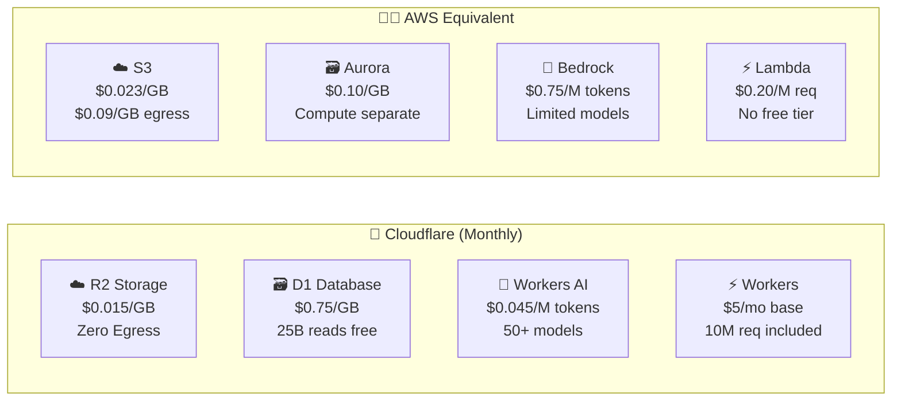
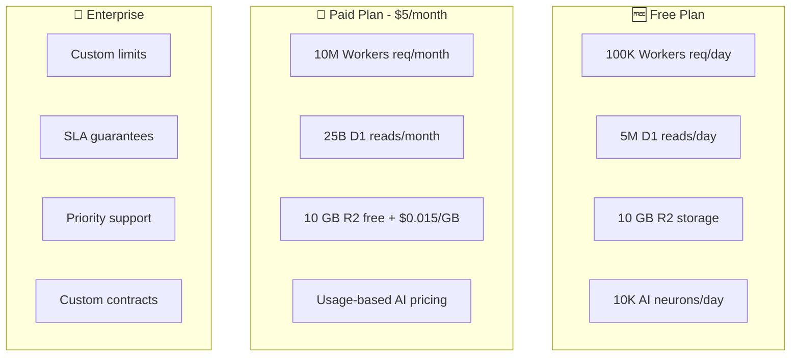

# 💰 Cloudflare Pricing Reference

> *"Insanely cheap" is not hyperbole — Cloudflare's developer platform pricing is designed to let you build at scale for pennies.*

This guide covers current pricing for Cloudflare's developer platform services. All prices are as of 2025–2026.

---

## 🎯 Quick Comparison

---

## ⚡ Workers (Compute)

| | Free | Paid ($5/month) |
|---|---|---|
| **Requests** | 100,000/day | 10 million/month included |
| **Extra requests** | — | $0.30 per million |
| **CPU time** | 10ms/invocation | 30 million CPU-ms/month |
| **Extra CPU** | — | $0.02 per million CPU-ms |
| **Script size** | 1 MB | 10 MB |
| **Cron triggers** | 5 | 5 |
| **Workers** | 100 | Unlimited |
| **Subrequests** | 50/invocation | 1,000/invocation |

> 💡 **Real-world cost**: A moderate API serving 5M requests/month costs about **$5/month total**.

📖 [Official pricing page](https://developers.cloudflare.com/workers/platform/pricing/)

---

## 🗄️ R2 Object Storage

| Metric | Free Tier | Paid |
|--------|-----------|------|
| **Standard storage** | 10 GB/month | **$0.015/GB/month** |
| **Infrequent Access** | — | **$0.01/GB/month** |
| **Class A ops** (write) | 1M/month | $4.50/million |
| **Class B ops** (read) | 10M/month | $0.36/million |
| **Egress** | — | **FREE** ✨ |

> 💡 **50 GB on R2 = ~$0.75/month** — the user in our community was charged about $0.50 for 50 GB!

### Cost Comparison: R2 vs S3

| | R2 | S3 (AWS) |
|---|---|---|
| Storage (100 GB) | **$1.50/mo** | $2.30/mo |
| Egress (1 TB) | **$0** | **$90.00** |
| Class A (1M ops) | $4.50 | $5.00 |
| **Total** | **$6.00** | **$97.30** |

📖 [Official R2 pricing](https://developers.cloudflare.com/r2/pricing/) · [R2 Calculator](https://r2-calculator.cloudflare.com/)

---

## 🗃️ D1 Serverless Database

| Metric | Free Tier | Paid |
|--------|-----------|------|
| **Rows read** | 5M/day | 25 billion/month included |
| **Extra reads** | — | **$0.001/million rows** |
| **Rows written** | 100K/day | 50 million/month included |
| **Extra writes** | — | $1.00/million rows |
| **Storage** | 5 GB | 5 GB included, then **$0.75/GB/month** |
| **Databases** | 50 | Unlimited |

> 💡 **D1 is absurdly cheap for reads** — 25 billion reads/month for $5 total (Workers paid plan).

📖 [Official D1 pricing](https://developers.cloudflare.com/d1/platform/pricing/)

---

## 🤖 Workers AI

Workers AI runs 50+ open-source models at the edge with no GPU management.

### Model Pricing Examples

| Model | Input (per M tokens) | Output (per M tokens) |
|-------|---------------------|----------------------|
| **Llama 3.2 1B** | $0.012 | $0.096 |
| **Llama 3.2 3B** | $0.024 | $0.192 |
| **Llama 3.2 8B** | **$0.045** | $0.384 |
| **Llama 3.1 70B FP8** | $0.293 | $2.253 |
| **Mistral 7B** | $0.110 | $0.190 |
| **Gemma 2B** | $0.012 | $0.096 |
| **Stable Diffusion XL** | $0.00056/step | — |
| **Whisper (speech)** | $0.00024/second | — |

### Free Tier

| Feature | Limit |
|---------|-------|
| Neurons | 10,000/day |
| Equivalent (Llama 8B) | ~200 queries/day |

> 💡 **A million tokens for ~$0.045–$0.60** depending on the model. The user's experience of **$0.60 for a million tokens** is typical for mid-range models.

📖 [Official AI pricing](https://developers.cloudflare.com/workers-ai/platform/pricing/)

---

## 📦 Workers KV

| Metric | Free Tier | Paid |
|--------|-----------|------|
| **Reads** | 100K/day | 10M/month included |
| **Extra reads** | — | $0.50/million |
| **Writes** | 1K/day | 1M/month included |
| **Extra writes** | — | $5.00/million |
| **Deletes** | 1K/day | 1M/month included |
| **Lists** | 1K/day | 1M/month included |
| **Storage** | 1 GB | 1 GB included, then $0.50/GB/month |

📖 [Official KV pricing](https://developers.cloudflare.com/kv/platform/pricing/)

---

## 🔒 Durable Objects

| Metric | Paid |
|--------|------|
| **Requests** | 1M/month included, then $0.15/million |
| **Duration** | 400K GB-s/month included, then $12.50/million GB-s |
| **Storage (reads)** | 1M/month included, then $0.20/million |
| **Storage (writes)** | 1M/month included, then $1.00/million |
| **Storage (deletes)** | 1M/month included, then $1.00/million |
| **Stored data** | 1 GB included, then $0.20/GB/month |

📖 [Official DO pricing](https://developers.cloudflare.com/durable-objects/platform/pricing/)

---

## 📨 Queues

| Metric | Free Tier | Paid |
|--------|-----------|------|
| **Standard operations** | 1M/month | $0.40/million |
| **Messages** | 1M/month | 1M included |
| **Message size** | 128 KB | 128 KB |

📖 [Official Queues pricing](https://developers.cloudflare.com/queues/platform/pricing/)

---

## 🔍 Vectorize

| Metric | Paid |
|--------|------|
| **Queried vector dimensions** | 50M/month included |
| **Extra dimensions** | $0.01/million dimensions |
| **Stored vector dimensions** | 10M included |
| **Extra stored** | $0.05/million dimensions/month |

📖 [Official Vectorize pricing](https://developers.cloudflare.com/vectorize/platform/pricing/)

---

## 🤖 AI Gateway

| Feature | Free | Paid |
|---------|------|------|
| **Logs** | 10K/day | Unlimited |
| **Caching** | ✓ | ✓ |
| **Rate limiting** | ✓ | ✓ |
| **Real-time analytics** | ✓ | ✓ |
| **Multi-provider** | ✓ | ✓ |

📖 [Official AI Gateway pricing](https://developers.cloudflare.com/ai-gateway/pricing/)

---

## 📊 Total Cost Examples

### 💡 Personal Blog / Side Project

| Service | Usage | Monthly Cost |
|---------|-------|-------------|
| Workers | 500K requests | **$5.00** (base plan) |
| D1 | 1M reads, 50K writes | **$0.00** (included) |
| R2 | 5 GB storage | **$0.00** (free tier) |
| | **Total** | **$5.00/month** |

### 💡 SaaS API (Medium Scale)

| Service | Usage | Monthly Cost |
|---------|-------|-------------|
| Workers | 50M requests | **$17.00** |
| D1 | 500M reads, 5M writes | **$0.00** (included) |
| R2 | 100 GB + 10M reads | **$1.50** |
| KV | 5M reads | **$0.00** (included) |
| | **Total** | **~$18.50/month** |

### 💡 AI Agent Platform

| Service | Usage | Monthly Cost |
|---------|-------|-------------|
| Workers | 10M requests | **$5.00** (base plan) |
| Workers AI | 10M tokens (Llama 8B) | **~$0.45** |
| Vectorize | 20M dimensions | **$0.00** (included) |
| D1 | 1B reads | **$0.00** (included) |
| R2 | 50 GB | **$0.75** |
| Durable Objects | 500K requests | **$0.00** (included) |
| | **Total** | **~$6.20/month** |

---

## 📐 Cost Calculators

| Calculator | Link |
|------------|------|
| R2 Calculator | [r2-calculator.cloudflare.com](https://r2-calculator.cloudflare.com/) |
| FlareCalc | [flarecalc.com](https://flarecalc.com/) |
| Serverless.Dev | [theserverless.dev/calculators/](https://theserverless.dev/calculators/) |

---

## 🏷️ Plan Comparison

---

## 🔗 Official Pricing Links

| Service | Pricing Page |
|---------|-------------|
| Workers | [developers.cloudflare.com/workers/platform/pricing/](https://developers.cloudflare.com/workers/platform/pricing/) |
| R2 | [developers.cloudflare.com/r2/pricing/](https://developers.cloudflare.com/r2/pricing/) |
| D1 | [developers.cloudflare.com/d1/platform/pricing/](https://developers.cloudflare.com/d1/platform/pricing/) |
| Workers AI | [developers.cloudflare.com/workers-ai/platform/pricing/](https://developers.cloudflare.com/workers-ai/platform/pricing/) |
| KV | [developers.cloudflare.com/kv/platform/pricing/](https://developers.cloudflare.com/kv/platform/pricing/) |
| Durable Objects | [developers.cloudflare.com/durable-objects/platform/pricing/](https://developers.cloudflare.com/durable-objects/platform/pricing/) |
| Queues | [developers.cloudflare.com/queues/platform/pricing/](https://developers.cloudflare.com/queues/platform/pricing/) |
| Vectorize | [developers.cloudflare.com/vectorize/platform/pricing/](https://developers.cloudflare.com/vectorize/platform/pricing/) |
| Plans overview | [cloudflare.com/plans/](https://www.cloudflare.com/plans/) |

---

*Prices are subject to change. Always verify with the [official Cloudflare pricing pages](https://www.cloudflare.com/plans/) for the most current rates.*
