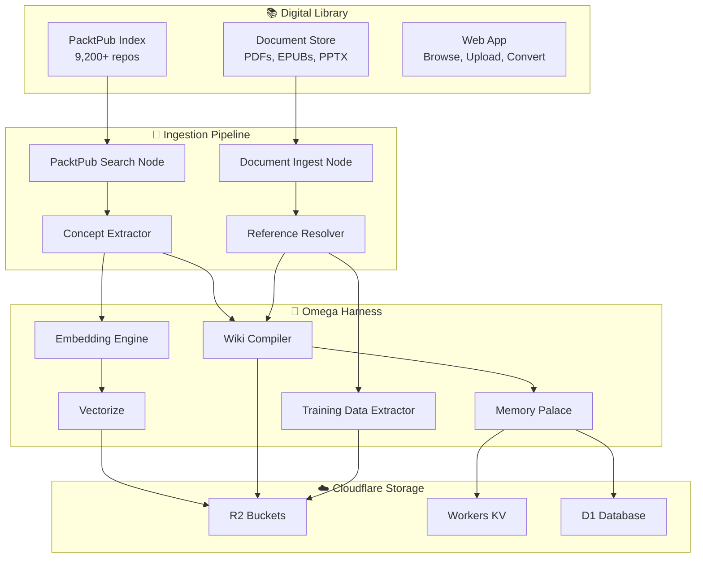

# 📚 Digital Library Knowledge Pipeline

> How the PacktPub "Library of Alexandria" feeds structured knowledge into the Omega Harness agent system.

---

## Overview

The [PACKTPub\_The\_Digital\_Library\_Of\_Alexandria](https://github.com/SpiralCloudOmega/PACKTPub_The_Digital_Library_Of_Alexandria) repository contains:

- **9,200+ indexed PacktPublishing repositories** — code samples, notebooks, and documentation for hundreds of technical books
- **Multi-format document storage** — PDFs, EPUBs, PPTX, XLSX, and more via Git LFS
- **Web application** — Filza-inspired file browser with upload, convert, edit, and search
- **Topic categorization** — 18 technology categories (AI/ML, Web Dev, Cloud, Security, etc.)
- **Automated indexing** — Weekly cron job regenerates the full repo index

This document describes how this knowledge base integrates with the Omega Harness to provide agents with structured reference material, training data, and contextual knowledge.

---

## Architecture



---

## Pipeline Stages

### Stage 1: Discovery & Search

The **PacktPub Search** node queries the 9,200+ repo index by:
- **Keyword search** — Full-text search across repo names and descriptions
- **Topic filter** — Filter by any of 18 categories (AI/ML, Web Development, Cloud & DevOps, etc.)
- **Language filter** — Python, JavaScript, TypeScript, Java, C#, Go, etc.
- **Recency** — Sort by last updated, most stars, or alphabetical

Returns structured results:
```json
{
  "repo": "PacktPublishing/Machine-Learning-with-Python-Cookbook-Third-Edition",
  "description": "Machine Learning with Python Cookbook, Third Edition, published by Packt",
  "topics": ["machine-learning", "python", "cookbook"],
  "url": "https://github.com/PacktPublishing/Machine-Learning-with-Python-Cookbook-Third-Edition",
  "stars": 42,
  "language": "Jupyter Notebook"
}
```

### Stage 2: Document Ingestion

The **Document Ingest** node handles multi-format parsing:

| Format | Parser | Output |
|--------|--------|--------|
| PDF | pdf-parse / pdfjs | Extracted text + page metadata |
| EPUB | epub.js | Chapter-structured text + TOC |
| PPTX | pptx-parser | Slide text + speaker notes |
| DOCX | mammoth | Structured HTML → Markdown |
| CSV/XLSX | xlsx | Tabular data → JSON arrays |
| Markdown | native | Direct passthrough with frontmatter |

### Stage 3: Concept Extraction

The **Concept Extractor** identifies:
- **Key terms & definitions** — Technical vocabulary with definitions
- **Code patterns** — Recurring code structures across examples
- **API signatures** — Function/class signatures for reference
- **Dependencies** — Libraries and frameworks mentioned

### Stage 4: Reference Resolution

The **Reference Resolver** links:
- Book chapters → specific directories in PacktPublishing repos
- Code snippets in books → live, runnable code in GitHub repos
- Concepts → related entries in CLOUDFLARE_INDEX.md, CLOUDFLARE_TOPICS.md

### Stage 5: Knowledge Compilation

The **Wiki Compiler** (from llm-wiki-compiler) produces:
- Interlinked wiki pages with `[[wikilinks]]`
- Concept hierarchies with parent/child relationships
- Cross-reference tables linking books → code → concepts

### Stage 6: Training Data Extraction

The **Training Data Extractor** generates:
- **Q&A pairs** — Question/answer from chapter exercises
- **Code completion** — Function stubs → complete implementations
- **Explanation pairs** — Concept → human-readable explanation
- Output format: JSONL for fine-tuning or RAG ingestion

### Stage 7: Storage & Retrieval

All artifacts are persisted to Cloudflare infrastructure:

| Artifact | Storage | Access Pattern |
|----------|---------|----------------|
| Wiki pages | R2 Bucket | Static HTML/Markdown serving |
| Embeddings | Vectorize | Similarity search (cosine/euclidean) |
| Training JSONL | R2 Bucket | Batch download for fine-tuning |
| Concept index | Workers KV | Fast key-based lookup |
| Reference graph | D1 Database | SQL joins for cross-references |
| Session memory | Memory Palace | Spatial organization + semantic recall |

---

## Workflow Template

The **Knowledge Acquisition Pipeline** (Template 7 in the Agent Builder) implements this full flow:

```
Cron Trigger → PacktPub Search + Document Ingest
             → Concept Extractor + Reference Resolver
             → Embedding Engine + Wiki Compiler + Training Extractor
             → Vectorize + R2 Bucket
```

10 nodes, 11 edges. Runs on a weekly schedule by default, or triggered manually.

---

## Integration with Other Subsystems

| Subsystem | Integration |
|-----------|------------|
| **Autoresearch Loop** | Research gaps identified → PacktPub searched for relevant books |
| **Memory Palace** | Wiki-compiled knowledge stored as spatial memories for agent recall |
| **Skill Evolution** | Training data extracted → used to evolve agent skill definitions |
| **RLM Decomposition** | Complex book topics → recursively decomposed into leaf concepts |
| **MCP Servers** | Reference resolver exposed as MCP tool for external AI assistants |
| **Archon** | Full pipeline defined as YAML DAG workflow for Archon orchestration |

---

## Quick Start

```bash
# Clone the library
git clone https://github.com/SpiralCloudOmega/PACKTPub_The_Digital_Library_Of_Alexandria.git

# Search the index programmatically
grep -i "machine learning" PACKT_INDEX.md | head -20

# Generate topic categories
python scripts/packt_stats.py --topics

# Upload a document
python scripts/upload.py --file mybook.pdf --dest docs/PDFs

# Launch the web app locally
open index.html
```

---

## Topic Categories (18 total)

| # | Category | Approx Repos |
|---|----------|-------------|
| 1 | Artificial Intelligence & Machine Learning | 1,200+ |
| 2 | Web Development (React, Angular, Vue, Django) | 900+ |
| 3 | Cloud & DevOps (AWS, Azure, GCP, Docker, K8s) | 800+ |
| 4 | Data Science & Analytics | 700+ |
| 5 | Programming Languages (Python, Java, C++, Go) | 600+ |
| 6 | Cybersecurity & Ethical Hacking | 500+ |
| 7 | Mobile Development (Android, iOS, Flutter) | 400+ |
| 8 | Databases & SQL | 350+ |
| 9 | Networking & Infrastructure | 300+ |
| 10 | Game Development (Unity, Unreal) | 250+ |
| 11 | Blockchain & Cryptocurrency | 200+ |
| 12 | Internet of Things (IoT) | 180+ |
| 13 | Business & Project Management | 150+ |
| 14 | Operating Systems (Linux, Windows) | 140+ |
| 15 | Desktop Applications | 120+ |
| 16 | Testing & QA | 100+ |
| 17 | UI/UX Design | 80+ |
| 18 | Other/Miscellaneous | 500+ |

---

## Related Documents

- [Omega_Harness_Architecture.md](Omega_Harness_Architecture.md) — Overall system architecture
- [Autoresearch_Loop_Design.md](Autoresearch_Loop_Design.md) — Perpetual research loops
- [Memory_Palace_Persistence.md](Memory_Palace_Persistence.md) — Cross-session memory
- [Cloudflare_Agent_Workflows.md](Cloudflare_Agent_Workflows.md) — All workflow templates
- [CLOUDFLARE_INDEX.md](CLOUDFLARE_INDEX.md) — Cloudflare repo index (478+ repos)
