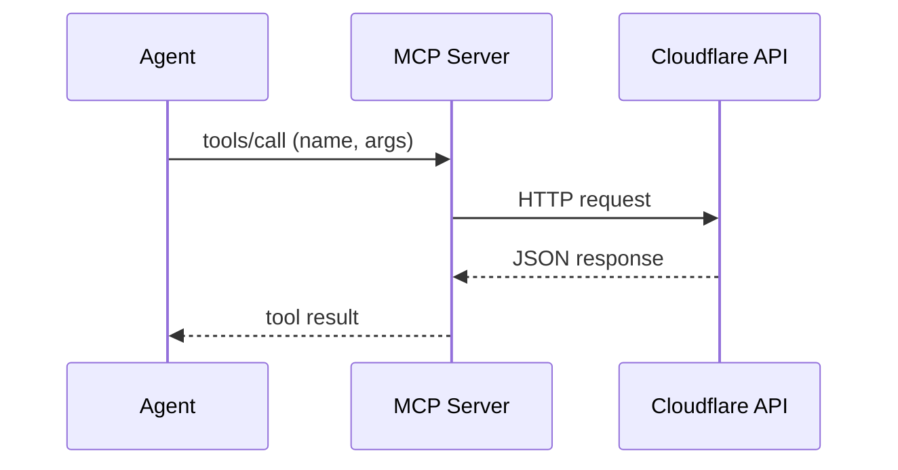
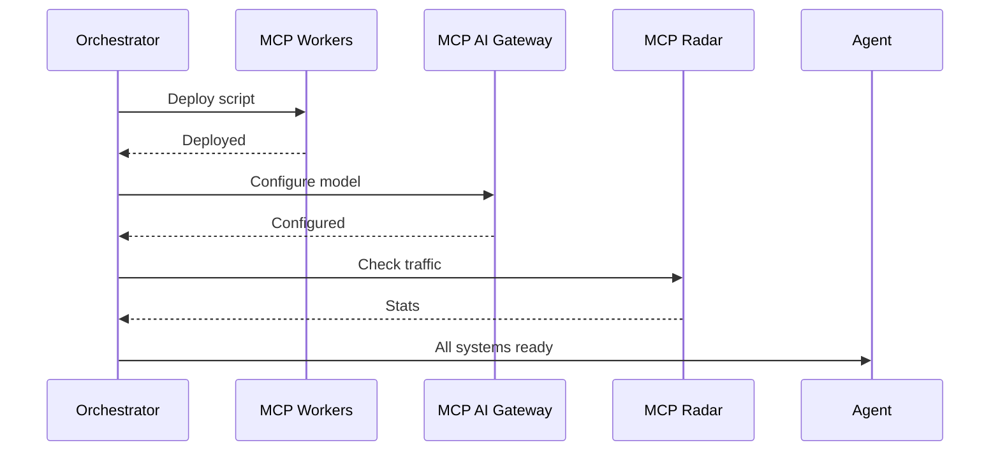
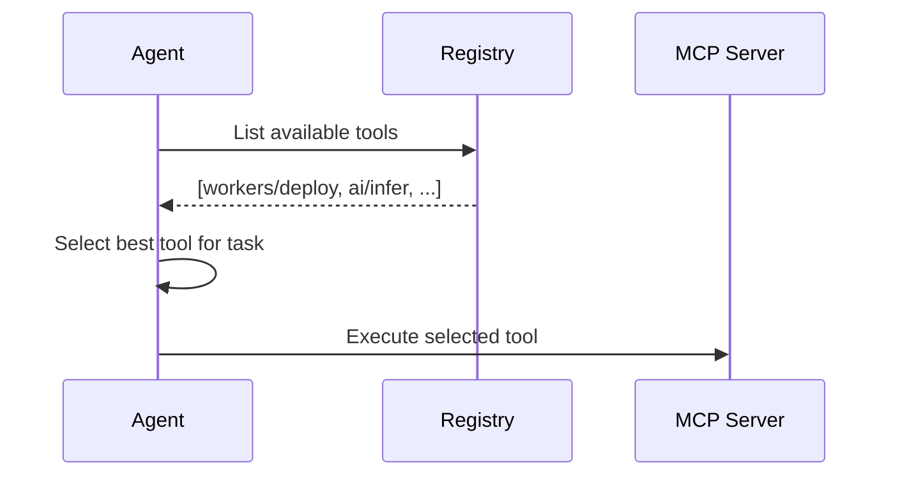

# 🤖 MCP Protocol Integration — Model Context Protocol for Cloudflare Agents

> **MCP (Model Context Protocol) provides a standardized interface for LLMs to access tools, resources, and context.** The Omega Harness integrates MCP as its primary protocol layer, with 15+ domain-specific Cloudflare servers.

---

## 📐 What is MCP?

The Model Context Protocol is an open standard that defines how AI models communicate with external tools and data sources. Think of it as the "USB standard" for AI — any MCP-compatible model can use any MCP-compatible server.

```
┌─────────────┐     MCP Protocol     ┌─────────────┐
│   LLM/Agent │ ◄──────────────────► │  MCP Server  │
│  (Client)   │    JSON-RPC / HTTP   │  (Tools)     │
└─────────────┘                      └─────────────┘
```

### MCP in the Omega Harness

```
┌────────────────────────────────────────────────────────┐
│                   Agent Orchestrator                    │
│  (Pre-plans which MCP servers each sub-agent needs)    │
└───────────────────────┬────────────────────────────────┘
                        │
         ┌──────────────┼──────────────┐
         │              │              │
    ┌────┴─────┐  ┌─────┴─────┐  ┌────┴─────┐
    │ MCP      │  │ MCP       │  │ MCP      │
    │ Workers  │  │ AI        │  │ Radar    │
    │ Server   │  │ Gateway   │  │ Server   │
    │          │  │ Server    │  │          │
    │ • Builds │  │ • Models  │  │ • Stats  │
    │ • Logs   │  │ • Cache   │  │ • Trends │
    │ • Binds  │  │ • Costs   │  │ • Data   │
    └──────────┘  └───────────┘  └──────────┘
```

---

## 🏗️ Omega Harness MCP Nodes

### Node: MCP Server

| Property | Value |
|----------|-------|
| **Category** | Protocol |
| **Source** | `SpiralCloudOmega/servers` |
| **Handles** | 1 input, 2 outputs |
| **Purpose** | Reference MCP implementation — provides the base protocol for tool access |

### Node: MCP Cloudflare

| Property | Value |
|----------|-------|
| **Category** | Protocol |
| **Source** | `SpiralCloudOmega/mcp-server-cloudflare` |
| **Handles** | 1 input, 2 outputs |
| **Purpose** | 15+ domain-specific MCP servers for Cloudflare services |

**Available Cloudflare MCP Servers:**

| Server | Domain | Key Tools |
|--------|--------|-----------|
| Workers | Compute | Build, deploy, manage Workers scripts |
| Workers Bindings | Configuration | KV, R2, D1, Queues bindings |
| Workers Observability | Monitoring | Logs, analytics, error tracking |
| Radar | Internet Intelligence | Traffic trends, attack data, routing |
| Container | Isolation | Sandboxed container management |
| Browser | Rendering | Headless Chrome, screenshots, PDFs |
| Logpush | Data Export | Log streaming to external destinations |
| AI Gateway | AI Proxy | Model routing, caching, rate limiting |
| AutoRAG | RAG | Automatic RAG pipeline management |
| Audit Logs | Security | Account activity, compliance |
| DNS Analytics | Network | Query patterns, resolution metrics |
| Digital Experience Monitoring | UX | Performance, availability, user experience |
| CASB | Cloud Security | SaaS application security |
| GraphQL | API | Flexible data queries across Cloudflare |
| Docs/References | Knowledge | Documentation search and retrieval |

### Node: MCP Tool Registry

| Property | Value |
|----------|-------|
| **Category** | Protocol |
| **Source** | `SpiralCloudOmega/mcp-server-cloudflare` |
| **Handles** | 1 input, 1 output |
| **Purpose** | Dynamic registry of available tools across all MCP servers |

### Node: MCP Transport

| Property | Value |
|----------|-------|
| **Category** | Protocol |
| **Source** | `SpiralCloudOmega/mcp-server-cloudflare` |
| **Handles** | 1 input, 1 output |
| **Purpose** | Streamable HTTP + SSE transport for distributed MCP |

---

## 🔄 MCP Communication Patterns

### Pattern 1: Direct Tool Call



### Pattern 2: Multi-Server Orchestration



### Pattern 3: Tool Discovery



---

## 🔐 Authentication and Configuration

### Per-Server Auth

Each MCP server requires its own authentication:

```
MCP_CLOUDFLARE_API_TOKEN=<global Cloudflare API token>
MCP_CLOUDFLARE_ACCOUNT_ID=<account ID>
MCP_AI_GATEWAY_ID=<gateway ID>
```

### Transport Configuration

```
MCP_TRANSPORT=streamable-http   # or: sse, stdio
MCP_SERVER_URL=https://mcp.example.com
MCP_SERVER_PORT=8787
```

### Environment Variable Pattern (from lambda-RLM)

Store MCP configurations as environment variables to minimize token cost:

```
# Instead of passing full config through context:
OMEGA_MCP_WORKERS=enabled
OMEGA_MCP_AI=enabled
OMEGA_MCP_RADAR=disabled

# Agent reads env vars at startup — zero token cost for config
```

---

## 🧰 Tool Definition Schema

Every MCP tool follows a typed schema:

```typescript
interface MCPTool {
  name: string;           // "workers/deploy"
  description: string;    // Human-readable description
  inputSchema: {          // JSON Schema for parameters
    type: "object";
    properties: Record<string, JSONSchema>;
    required: string[];
  };
  outputSchema?: {        // Optional output schema
    type: "object";
    properties: Record<string, JSONSchema>;
  };
}
```

### Example Tool: Deploy Worker

```json
{
  "name": "workers/deploy",
  "description": "Deploy a Worker script to Cloudflare",
  "inputSchema": {
    "type": "object",
    "properties": {
      "name": { "type": "string", "description": "Worker name" },
      "script": { "type": "string", "description": "JavaScript/TypeScript source" },
      "bindings": {
        "type": "array",
        "items": {
          "type": "object",
          "properties": {
            "type": { "enum": ["kv", "r2", "d1", "queue", "ai"] },
            "name": { "type": "string" }
          }
        }
      }
    },
    "required": ["name", "script"]
  }
}
```

---

## 🔗 Integration with Omega Harness Components

| Component | MCP Integration |
|-----------|----------------|
| **Skill Executor** | Calls MCP tools as skill implementations |
| **Archon Workflow** | Uses MCP for deterministic validation steps |
| **Memory Palace** | MCP server wraps KV/R2/D1 for memory operations |
| **Wiki Compiler** | MCP Docs server provides source material |
| **Autoresearch** | MCP Radar + external search via MCP |
| **Copilot CLI** | CLI SDK dispatches to MCP servers |

---

*Protocol integration defined: 2026-04-13 by Copilot coding agent (Session 5)*
