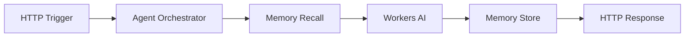
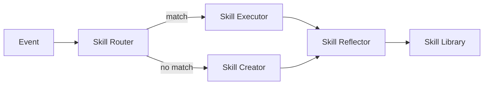
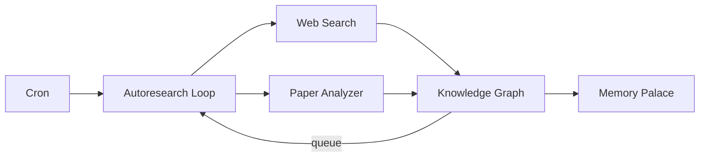
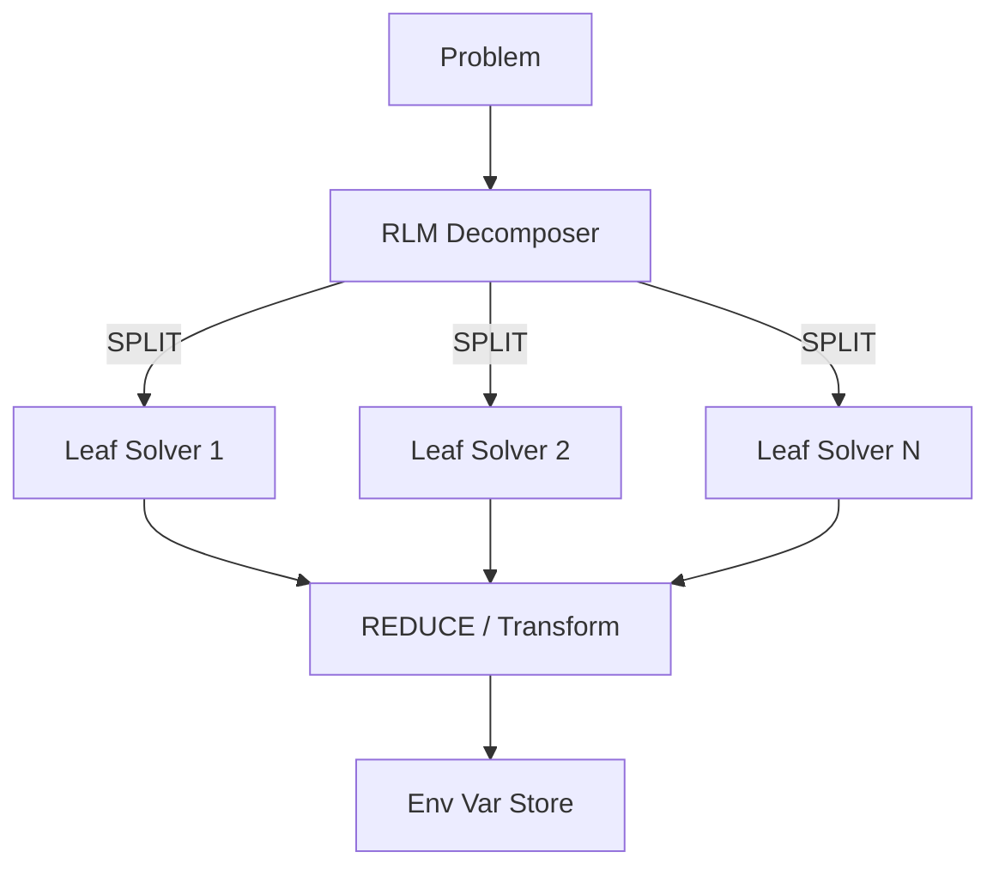

# 🏗️ Omega Harness Architecture — Unified Multi-Agent Framework

> **The Omega Harness is a serverless-first, visual multi-agent orchestration framework built on Cloudflare's edge infrastructure.** It unifies patterns from 12+ open-source projects into a single composable system with n8n-style graph node visualization.

---

## 🎯 Design Philosophy

### The Hospital Analogy

> A hospital doesn't just hire smart doctors — it has scheduling systems, protocols, electronic records, and oversight committees (the harness) that make everything work together reliably.

The Omega Harness is the hospital. Individual agents are the doctors. The harness provides:

| Hospital System | Omega Equivalent | Implementation |
|----------------|-----------------|----------------|
| Patient Records | **Memory Palace** (mempalace) | Vectorize + KV + R2 persistent memory |
| Scheduling | **Archon Workflow Engine** | YAML DAG orchestration |
| Medical Protocols | **MCP Protocol Servers** | Model Context Protocol tools |
| Doctor Skills | **Memento Skill Library** | Self-evolving skill framework |
| Research Library | **Wiki Compiler + Autoresearch** | llm-wiki-compiler + perpetual loops |
| Quality Assurance | **Meta-Harness Validation** | Terminal-Bench agent scaffold |
| Communication | **Copilot CLI SDK** | Terminal-based agent runtime |

---

## 📐 System Architecture

### Layer Diagram

```
┌─────────────────────────────────────────────────────────────────┐
│                    VISUAL LAYER (React + React Flow)             │
│  n8n-style node graph editor · drag-and-drop · 56 node types    │
│  14 categories · 6 pre-built workflow templates · JSON export    │
├─────────────────────────────────────────────────────────────────┤
│                    ORCHESTRATION LAYER                           │
│  ┌──────────────┐  ┌──────────────┐  ┌──────────────────────┐  │
│  │   Archon      │  │  Copilot CLI │  │  Agent Orchestrator  │  │
│  │  YAML DAGs    │  │    SDK       │  │  (Rocket Ship Model) │  │
│  └──────────────┘  └──────────────┘  └──────────────────────┘  │
├─────────────────────────────────────────────────────────────────┤
│                    INTELLIGENCE LAYER                            │
│  ┌──────────┐  ┌──────────┐  ┌──────────┐  ┌──────────────┐   │
│  │Workers AI│  │ Vectorize│  │ AutoRAG  │  │  AI Gateway  │   │
│  │ LLM/Emb  │  │ Vectors  │  │ RAG Pipe │  │  Proxy/Cache │   │
│  └──────────┘  └──────────┘  └──────────┘  └──────────────┘   │
├─────────────────────────────────────────────────────────────────┤
│                    CAPABILITY LAYER                              │
│  ┌─────────────┐  ┌──────────────┐  ┌────────────────────┐    │
│  │Memento Skills│  │  MCP Servers │  │ Wiki Compiler      │    │
│  │Read→Exec→   │  │ 15+ Domains  │  │ Concept Extract →  │    │
│  │Reflect→Write│  │ Tool Registry│  │ Page Generate      │    │
│  └─────────────┘  └──────────────┘  └────────────────────┘    │
├─────────────────────────────────────────────────────────────────┤
│                    MEMORY LAYER                                  │
│  ┌──────────────┐  ┌──────────────┐  ┌──────────────────┐     │
│  │ Memory Palace │  │ Env Var Store│  │ Context Window   │     │
│  │  (mempalace)  │  │  (λ-RLM)    │  │  (Fuel Gauge)    │     │
│  └──────────────┘  └──────────────┘  └──────────────────┘     │
├─────────────────────────────────────────────────────────────────┤
│                    PERSISTENCE LAYER (Cloudflare)                │
│  ┌──────┐  ┌────┐  ┌────┐  ┌────────────┐  ┌──────────────┐  │
│  │  KV  │  │ R2 │  │ D1 │  │ Hyperdrive │  │   Queues     │  │
│  └──────┘  └────┘  └────┘  └────────────┘  └──────────────┘  │
├─────────────────────────────────────────────────────────────────┤
│                    INFRASTRUCTURE (Cloudflare Edge)              │
│  Workers · Durable Objects · Pages · Tunnel · Zero Trust        │
│  Containers · Browser Rendering · Logpush                       │
└─────────────────────────────────────────────────────────────────┘
```

---

## 🚀 The Rocket Ship Model

Every agent workflow is a rocket launch:

```
                    🛰️  ORBIT (Deployed Result)
                   /
              ════╧════
              ║ FINAL ║   ← Agent Orchestrator: the payload
              ║ STAGE ║      Pre-plans context for all stages
              ════╤════
              ║STAGE 3║   ← Skill Reflector: evaluate + evolve
              ║       ║
              ════╤════
              ║STAGE 2║   ← Skill Executor: run the task
              ║       ║
              ════╤════
              ║STAGE 1║   ← Memory Recall: load context
              ║       ║
              ════╤════
              ║BOOSTER║   ← Trigger: HTTP/Cron/Webhook/Event
              ║       ║
          ▓▓▓▓▓▓▓▓▓▓▓▓▓▓▓
         ▓▓▓▓▓ LAUNCH ▓▓▓▓▓
          ▓▓▓▓▓▓▓▓▓▓▓▓▓▓▓
              🔥🔥🔥🔥
```

**Key Principle:** Fuel = Context Window. Each sub-agent receives exactly the context it needs — no more, no less. The orchestrator pre-plans all context before dispatch.

---

## 🧩 Subsystem Integration Map

### How Each Repo Maps to Omega Nodes

| Source Repository | Omega Nodes | Purpose in Harness |
|-------------------|-------------|-------------------|
| `Archon` | Archon Workflow, Archon Plan, Archon Validate | YAML DAG orchestration, deterministic workflows |
| `mempalace` | Memory Palace, Memory Store, Memory Recall | Persistent memory across agent sessions |
| `Memento-Skills` | Skill Router, Skill Executor, Skill Reflector, Skill Creator, Skill Library | Self-evolving capability framework |
| `llm-wiki-compiler` | Wiki Compiler, Concept Extractor, Incremental Builder, Wikilink Resolver | Knowledge compilation and wiki generation |
| `lambda-RLM` | RLM Decomposer, RLM Leaf Solver, Env Variable Store | Recursive task decomposition via lambda-calculus |
| `meta-harness-tbench2-artifact` | Meta-Harness | Agent scaffold with environment bootstrap |
| `servers` (MCP) | MCP Server | Reference Model Context Protocol implementation |
| `mcp-server-cloudflare` | MCP Cloudflare, MCP Tool Registry, MCP Transport | 15+ domain-specific Cloudflare MCP servers |
| `MegaTrain` | Double Buffer, Checkpoint | Pipeline optimization patterns |
| `awesome-autoresearch` | Autoresearch Loop, Web Search Agent, Paper Analyzer | Perpetual autonomous research |
| `claude-cookbooks` | Prompt Template | Dynamic prompt rendering with variable injection |
| `claude-code-best-practice` | Agent Orchestrator, Sub-Agent | Agent team patterns and orchestration strategies |

---

## 🔄 Data Flow Patterns

### Pattern 1: Stateful Agent with Memory



### Pattern 2: Self-Evolving Skills



### Pattern 3: Perpetual Research



### Pattern 4: Recursive Decomposition (RLM)



---

## 🏭 Deployment Architecture

### Serverless-First on Cloudflare

```
                    Internet
                       │
              ┌────────┴────────┐
              │  Cloudflare CDN  │
              │   (Edge Cache)   │
              └────────┬────────┘
                       │
         ┌─────────────┼─────────────┐
         │             │             │
    ┌────┴────┐  ┌─────┴─────┐  ┌───┴────┐
    │ Workers │  │ Durable   │  │ Pages  │
    │ (Logic) │  │ Objects   │  │ (UI)   │
    │         │  │ (State)   │  │        │
    └────┬────┘  └─────┬─────┘  └───┬────┘
         │             │             │
    ┌────┴─────────────┴─────────────┴────┐
    │         Cloudflare Bindings          │
    │  KV · R2 · D1 · Vectorize · Queues  │
    │  Workers AI · AI Gateway · Tunnel    │
    └─────────────────────────────────────┘
```

### VS Code Full-Stack Mode

When running locally in VS Code, the Omega Harness becomes a full-stack application:

1. **Frontend:** Vite + React site with node graph editor
2. **Backend:** Wrangler dev server (local Workers runtime)
3. **State:** Local D1 SQLite + KV namespace
4. **AI:** Workers AI via Wrangler proxy or AI Gateway
5. **CLI:** Copilot CLI SDK driving agent sessions

---

## 📊 Node Category Summary

| Category | Count | Color | Purpose |
|----------|-------|-------|---------|
| Triggers | 6 | 🔵 #3b82f6 | Entry points (HTTP, Cron, Webhook, Queue, Event, Git Push) |
| Compute | 5 | 🟡 #f59e0b | Edge execution (Worker, DO, Pages, Container, Browser) |
| AI & Inference | 5 | 🟢 #10b981 | Intelligence (Workers AI, Vectorize, AutoRAG, Gateway, Embedding) |
| Agents | 6 | 🟣 #6366f1 | Orchestration (Orchestrator, Sub-Agent, Archon x3, Meta-Harness) |
| Memory | 5 | 🩷 #ec4899 | Persistence (Palace, Store, Recall, Context Window, Env Vars) |
| Skills | 5 | 🟠 #f97316 | Self-evolving (Router, Executor, Reflector, Creator, Library) |
| Protocols | 5 | 💜 #8b5cf6 | Standards (MCP Server, Cloudflare, Registry, Transport, CLI) |
| Research | 4 | 🩵 #0ea5e9 | Discovery (Autoresearch, Web Search, Paper, Knowledge Graph) |
| Compiler | 4 | 💚 #84cc16 | Knowledge build (Wiki, Concept Extract, Incremental, Wikilink) |
| Training & RLM | 4 | ❤️ #e11d48 | Optimization (RLM Decompose, Leaf Solver, Double Buffer, Checkpoint) |
| Storage | 4 | 💜 #a855f7 | Data (KV, R2, D1, Hyperdrive) |
| Network | 2 | 🔴 #ef4444 | Security (Tunnel, Zero Trust) |
| Transform | 4 | 🩵 #06b6d4 | Reshaping (JSON, HTML, Filter, Prompt Template) |
| Output | 4 | 🟢 #14b8a6 | Sinks (HTTP Response, Logger, Queue, Notification) |
| **Total** | **63** | | |

---

## 🔗 Source Repositories

| Repository | GitHub URL | Primary Contribution |
|-----------|-----------|---------------------|
| Archon | `SpiralCloudOmega/Archon` | YAML workflow engine |
| mempalace | `SpiralCloudOmega/mempalace` | Persistent AI memory |
| Memento-Skills | `SpiralCloudOmega/Memento-Skills` | Self-evolving skills |
| llm-wiki-compiler | `SpiralCloudOmega/llm-wiki-compiler` | Knowledge compilation |
| lambda-RLM | `SpiralCloudOmega/lambda-RLM` | Recursive decomposition |
| meta-harness-tbench2-artifact | `SpiralCloudOmega/meta-harness-tbench2-artifact` | Agent scaffolding |
| servers | `SpiralCloudOmega/servers` | MCP reference |
| mcp-server-cloudflare | `SpiralCloudOmega/mcp-server-cloudflare` | Cloudflare MCP |
| MegaTrain | `SpiralCloudOmega/MegaTrain` | Pipeline optimization |
| awesome-autoresearch | `SpiralCloudOmega/awesome-autoresearch` | Autoresearch patterns |
| claude-cookbooks | `SpiralCloudOmega/claude-cookbooks` | Prompt patterns |
| claude-code-best-practice | `SpiralCloudOmega/claude-code-best-practice` | Agent orchestration |

---

*Architecture defined: 2026-04-13 by Copilot coding agent (Session 5)*
