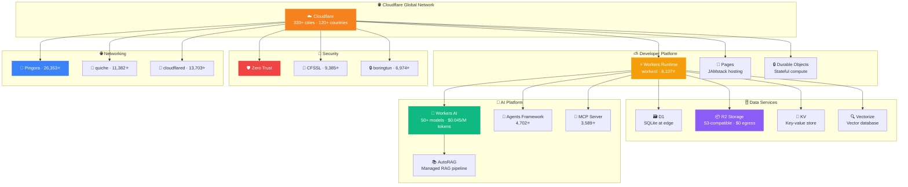
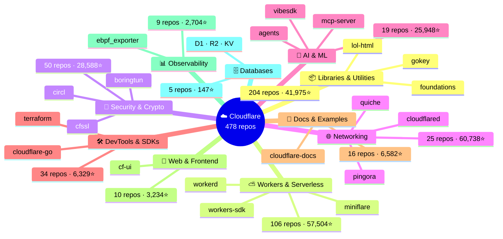
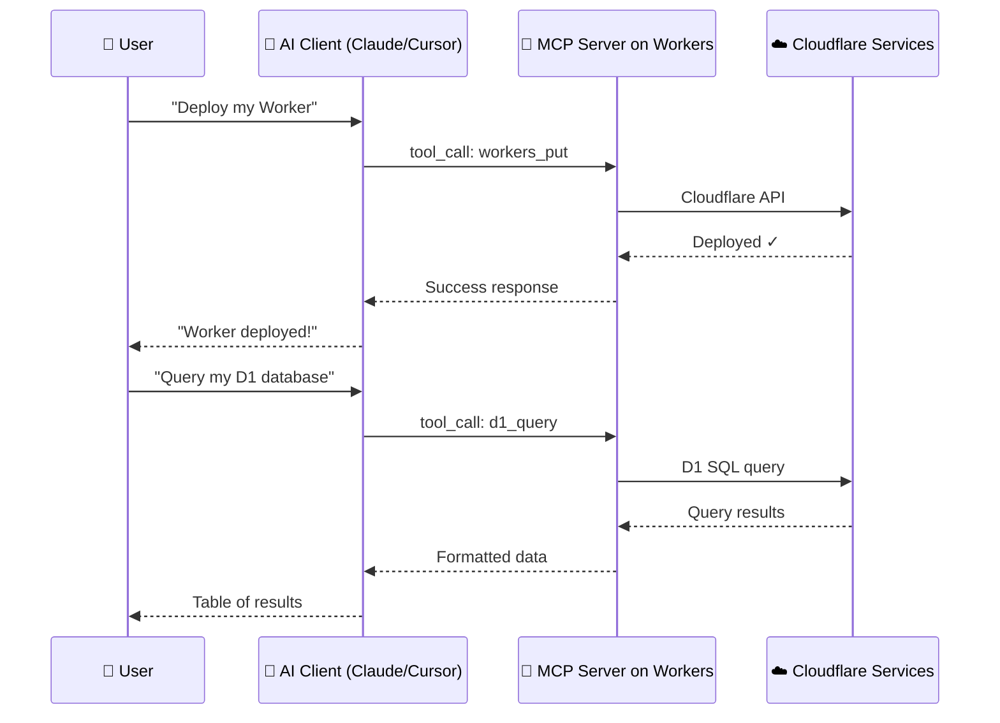

# ☁️ Cloudflare Open-Source Index

> *"The Internet's on-ramp, edge-to-edge — now fully indexed."*

A comprehensive, community-friendly index of **all 478+ public repositories** from the [Cloudflare GitHub Organization](https://github.com/cloudflare) — the team behind Workers, Pingora, QUIC, Zero Trust, and some of the most widely-deployed network infrastructure on the planet.

[](https://github.com/cloudflare)
[](CLOUDFLARE_INDEX.md)
[](CLOUDFLARE_INDEX.md)
[](https://github.com/SpiralCloudOmega/Cloudflare_Index/actions/workflows/update_cloudflare_index.yml)
[](LICENSE)
[](CONTRIBUTING.md)

> 🌐 **[Launch Interactive Explorer →](https://SpiralCloudOmega.github.io/Cloudflare_Index/)** — 3D node graph, animated stats, searchable repo table

---

## 🚀 Browse the Index

| File | What it contains |
|------|-----------------|
| 🌐 **[Interactive Explorer](https://SpiralCloudOmega.github.io/Cloudflare_Index/)** | Visual, animated, searchable web app with 3D ecosystem graph |
| 📋 **[CLOUDFLARE_INDEX.md](CLOUDFLARE_INDEX.md)** | All 478 repos alphabetically (A–Z) with descriptions, languages & star counts |
| 🗂️ **[CLOUDFLARE_TOPICS.md](CLOUDFLARE_TOPICS.md)** | All repos grouped by technology category with highlights & collapsible full lists |
| 🗺️ **[CLOUDFLARE_ECOSYSTEM.md](CLOUDFLARE_ECOSYSTEM.md)** | Product-to-repo mapping: every Cloudflare product and its corresponding open source repos |
| ⛅ **[AWESOME_CLOUDFLARE.md](AWESOME_CLOUDFLARE.md)** | Curated community tools, frameworks (Hono, RedwoodSDK), awesome lists |
| 🤖 **[CLOUDFLARE_MCP.md](CLOUDFLARE_MCP.md)** | MCP integration guide — connect AI assistants to Cloudflare services |
| 💰 **[CLOUDFLARE_PRICING.md](CLOUDFLARE_PRICING.md)** | Pricing reference — Workers AI ($0.045/M tokens), R2 ($0.015/GB), D1, KV |

---

## 📂 Repository Structure

```
📁 site/                            — Interactive React app (GitHub Pages)
├── src/components/                — Hero, Stats, EcosystemGraph, RepoExplorer
├── src/data/repos.ts              — Category data & repo metadata
├── vite.config.ts                 — Vite build configuration
└── dist/                          — Built static site

📁 scripts/
└── generate_cloudflare_index.py   — Regenerate the index from GitHub API

📁 .github/workflows/
├── update_cloudflare_index.yml    — Weekly auto-update (every Monday)
└── deploy_site.yml                — Build & deploy interactive site to GitHub Pages

📄 CLOUDFLARE_INDEX.md       — A-to-Z clickable index of all Cloudflare repos
📄 CLOUDFLARE_TOPICS.md      — Topic-organized view (AI/ML, Workers, Security, DNS…)
📄 CLOUDFLARE_ECOSYSTEM.md   — Product-to-repo ecosystem map
📄 AWESOME_CLOUDFLARE.md     — Curated community tools, frameworks, awesome lists
📄 CLOUDFLARE_MCP.md         — MCP integration guide with architecture diagrams
📄 CLOUDFLARE_PRICING.md     — Pricing reference for all Cloudflare services
📄 CONTRIBUTING.md            — How to contribute
📄 LICENSE                    — MIT License
```

---

## 🗺️ Ecosystem Architecture



---

## 🛠️ Cloudflare Templates (Ready to Deploy)

This project was built using Cloudflare's official templates — you can use them too:

| Template | What it is | Deploy |
|----------|------------|--------|
| **[vite-react-template](https://github.com/SpiralCloudOmega/vite-react-template)** | Vite + React + Hono + Cloudflare Workers — full-stack app | `npm create cloudflare@latest -- --framework=react` |
| **[r2-explorer-template](https://github.com/SpiralCloudOmega/r2-explorer-template)** | Google Drive-like UI for R2 buckets — drag & drop, preview, edit | `npm create cloudflare@latest -- --template=r2-explorer-template` |

> 💡 The **interactive explorer** in this repo is built on the vite-react-template. The R2 Explorer is a separate app for managing your R2 storage with a beautiful file-manager UI.

---

## 🏆 Most-Starred Cloudflare Repos

> Stars are a snapshot in time — the ecosystem evolves fast. See [CLOUDFLARE_INDEX.md](CLOUDFLARE_INDEX.md) for the latest counts.

| # | Repository | Stars | What it is |
|---|------------|-------|-----------|
| 1 | [pingora](https://github.com/cloudflare/pingora) | 26,353 ⭐ | Build fast, reliable network services in Rust — Cloudflare's internal proxy, now open-source |
| 2 | [cloudflared](https://github.com/cloudflare/cloudflared) | 13,703 ⭐ | Cloudflare Tunnel client — expose local services without opening firewall ports |
| 3 | [quiche](https://github.com/cloudflare/quiche) | 11,382 ⭐ | Production-grade QUIC and HTTP/3 implementation in Rust |
| 4 | [moltworker](https://github.com/cloudflare/moltworker) | 9,806 ⭐ | OpenClaw game engine running on Cloudflare Workers — a community project that went viral for showcasing what Workers can do |
| 5 | [cfssl](https://github.com/cloudflare/cfssl) | 9,385 ⭐ | Cloudflare's PKI and TLS toolkit — widely adopted by the Kubernetes ecosystem |
| 6 | [workerd](https://github.com/cloudflare/workerd) | 8,107 ⭐ | The open-source JavaScript/Wasm runtime that powers Cloudflare Workers |
| 7 | [vinext](https://github.com/cloudflare/vinext) | 7,710 ⭐ | Next.js API reimplemented as a Vite plugin — full Next.js compatibility deployable at the edge |
| 8 | [boringtun](https://github.com/cloudflare/boringtun) | 6,974 ⭐ | Userspace WireGuard® implementation in Rust, powering Cloudflare WARP |
| 9 | [vibesdk](https://github.com/cloudflare/vibesdk) | 4,930 ⭐ | Open-source vibe coding IDE platform built on Workers |
| 10 | [agents](https://github.com/cloudflare/agents) | 4,702 ⭐ | Framework for building and deploying stateful AI Agents on Cloudflare |

---

## 🗂️ Technology Categories



| Category | Repos | What's inside |
|----------|-------|--------------|
| 📦 [Libraries & Utilities](CLOUDFLARE_TOPICS.md#libraries--utilities) | 178 | Rust/Go/C libraries, parsers, algorithms, general-purpose utilities |
| ⛅ [Workers & Serverless](CLOUDFLARE_TOPICS.md#workers--serverless) | 106 | Wrangler, workerd, Miniflare, Durable Objects, D1, KV, Queues |
| 🔐 [Security & Cryptography](CLOUDFLARE_TOPICS.md#security--cryptography) | 53 | CFSSL, boringtun, CIRCL, Zero Trust, Privacy Pass, post-quantum crypto |
| 🛠️ [Developer Tools & SDKs](CLOUDFLARE_TOPICS.md#developer-tools--sdks) | 36 | Go/Python/TypeScript SDKs, Terraform provider, Pulumi, CLI tools |
| 🌐 [Networking & Infrastructure](CLOUDFLARE_TOPICS.md#networking--infrastructure) | 28 | Pingora, quiche, cloudflared, BGP/RPKI, eBPF networking |
| 🤖 [AI & Machine Learning](CLOUDFLARE_TOPICS.md#ai--machine-learning) | 21 | Workers AI, Agents, MCP Server, AutoRAG, Vectorize |
| 📖 [Documentation & Examples](CLOUDFLARE_TOPICS.md#documentation--examples) | 20 | cloudflare-docs (Astro), blog samples, demo projects |
| 🗄️ [Databases & Storage](CLOUDFLARE_TOPICS.md#databases--storage) | 16 | D1 (SQLite at edge), R2 (S3-compatible), KV, Queues, object storage |
| 🎨 [Web & Frontend](CLOUDFLARE_TOPICS.md#web--frontend) | 11 | Kumo, CF-UI, React components, accessibility tools |
| 📊 [Observability & Monitoring](CLOUDFLARE_TOPICS.md#observability--monitoring) | 9 | eBPF exporter, Prometheus tooling, Alertmanager integrations |

---

## 🏢 About Cloudflare

Cloudflare (NYSE: NET) is one of the world's largest network services companies, with infrastructure in **330+ cities across 120+ countries**, serving over **20 million internet properties**. Their global Anycast network handles more than 55 million HTTP requests per second at peak.

### What Cloudflare Does

| Product Area | What It Provides |
|-------------|-----------------|
| 🌐 **CDN & Performance** | Global content delivery, smart routing (Argo), image optimization |
| ⛅ **Developer Platform** | Workers (serverless), Pages (hosting), D1 (SQL), R2 (storage), KV, Durable Objects, Queues |
| 🤖 **AI Platform** | Workers AI (50+ models), Vectorize (vector DB), AutoRAG (managed RAG), AI Gateway |
| 🔐 **Zero Trust / SASE** | ZTNA, SWG, CASB, Browser Isolation, Email Security (Area 1), DLP |
| 🛡️ **Security** | WAF, DDoS protection, API Shield, Bot Management, Magic Transit |
| 🔑 **Identity & Access** | Cloudflare Access, Gateway, WARP |
| 📡 **Networking** | Magic WAN, Spectrum, Load Balancing, Tunnel, Argo Smart Routing |
| 📊 **Analytics** | Traffic analytics, Security insights, Logpush |

> 💡 **Developer Docs**: [developers.cloudflare.com](https://developers.cloudflare.com/) · **Blog**: [blog.cloudflare.com](https://blog.cloudflare.com/) · **Discord**: [discord.cloudflare.com](https://discord.cloudflare.com/)

---

## 🤖 Notable AI & Serverless Repos

### AI Agent Architecture



> 📖 Full MCP guide: [CLOUDFLARE_MCP.md](CLOUDFLARE_MCP.md) · Pricing: [CLOUDFLARE_PRICING.md](CLOUDFLARE_PRICING.md)

### AI & Agents
- **[agents](https://github.com/cloudflare/agents)** (4,702⭐) — Full framework for building stateful AI agents on Workers with persistent state via Durable Objects
- **[mcp-server-cloudflare](https://github.com/cloudflare/mcp-server-cloudflare)** (3,589⭐) — Cloudflare's official MCP (Model Context Protocol) server for AI tool integrations
- **[vibesdk](https://github.com/cloudflare/vibesdk)** (4,930⭐) — Open-source vibe coding IDE platform built entirely on Cloudflare Workers
- **[agents-starter](https://github.com/cloudflare/agents-starter)** (1,223⭐) — Batteries-included starter kit for deploying AI agents on Cloudflare Workers
- **[ai-utils](https://github.com/cloudflare/ai-utils)** — Utility library for Workers AI including streaming helpers and model wrappers

### Workers Runtime & Tooling
- **[workerd](https://github.com/cloudflare/workerd)** (8,107⭐) — The open-source JavaScript/Wasm runtime powering Cloudflare Workers (Apache 2.0)
- **[workers-sdk](https://github.com/cloudflare/workers-sdk)** (3,951⭐) — Wrangler CLI and the entire Workers developer toolchain
- **[miniflare](https://github.com/cloudflare/miniflare)** (3,908⭐) — Fully-local simulator for Cloudflare Workers — develop offline, test fast
- **[workers-rs](https://github.com/cloudflare/workers-rs)** (3,414⭐) — Write Cloudflare Workers in 100% Rust compiled to WebAssembly

---

## 🔐 Security Powerhouses

- **[cfssl](https://github.com/cloudflare/cfssl)** (9,385⭐) — Cloudflare's PKI/TLS toolkit — battle-tested CA management, used widely in the Kubernetes ecosystem
- **[boringtun](https://github.com/cloudflare/boringtun)** (6,974⭐) — Userspace WireGuard® implementation in Rust; powers the Cloudflare WARP client
- **[flan](https://github.com/cloudflare/flan)** (4,148⭐) — Pretty sweet vulnerability scanner built on nmap + Vulners for CVE detection
- **[circl](https://github.com/cloudflare/circl)** (1,651⭐) — Cryptographic Research Library in Go: post-quantum algorithms, OPRF, PAKEs, and more
- **[privacypass-ts](https://github.com/cloudflare/privacypass-ts)** — TypeScript implementation of the IETF Privacy Pass protocol

---

## 🌐 Networking Excellence

- **[pingora](https://github.com/cloudflare/pingora)** (26,353⭐) — Cloudflare's HTTP proxy framework in Rust; replaced nginx internally, handling trillions of requests
- **[quiche](https://github.com/cloudflare/quiche)** (11,382⭐) — Production-grade QUIC and HTTP/3 in Rust, deployed at Cloudflare's global edge
- **[cloudflared](https://github.com/cloudflare/cloudflared)** (13,703⭐) — Cloudflare Tunnel daemon — zero-config inbound connections, no port forwarding needed
- **[ebpf_exporter](https://github.com/cloudflare/ebpf_exporter)** (2,548⭐) — Prometheus exporter for custom eBPF kernel metrics with YAML-driven configuration

---

## 📊 Stats at a Glance

| Metric | Value |
|--------|-------|
| 🏢 Organization | [github.com/cloudflare](https://github.com/cloudflare) |
| 📦 Public Repos | **478** |
| ⭐ Total Stars | **233,749** |
| 🍴 Total Forks | **43,163** |
| 💻 Top Language | **TypeScript** (109 repos) |
| 🌐 JavaScript repos | **97** |
| 🐹 Go repos | **85** |
| 🦀 Rust repos | **47** |
| 🐍 Python repos | **23** |
| 🔄 Index updated | **Every Monday** (GitHub Actions) |

---

## 🌱 Cloudflare's Open Source Journey

Cloudflare takes a "two-way street" approach to open source: they consume it, contribute back, and open-source their core infrastructure components.

### Key Milestones

| Year | Milestone |
|------|-----------|
| 2014 | **CFSSL** released — PKI/TLS toolkit now used by the Kubernetes ecosystem |
| 2018 | **boringtun** — Userspace WireGuard in Rust, powers WARP |
| 2019 | **quiche** — QUIC + HTTP/3 in Rust, deployed at massive scale |
| 2021 | **workerd** — Workers runtime open-sourced under Apache 2.0 |
| 2022 | **flan** — Vulnerability scanner; **circl** — Cryptographic library |
| 2023 | **pingora** — Internal HTTP proxy framework open-sourced (26k⭐) |
| 2024 | **agents** — AI agent framework; **mcp-server-cloudflare** — MCP protocol support |
| 2025 | Docs migrated to Astro (open source); sponsorships of Ladybird, TanStack, Astro |

### Sponsorships & Contributions
- Co-sponsored **Ladybird browser** with Webflow and Netlify
- Sponsors **Astro**, **TanStack**, and other critical web infrastructure projects
- Offers free Cloudflare Pro plans to qualifying open source projects
- Employees contribute upstream to Rust, Go, Linux networking, and IETF standards

### Notable Blog Posts on Open Source
- [Open Source: A Two-Way Street](https://blog.cloudflare.com/open-source-two-way-street/)
- [Pingora: How Cloudflare Built a New Proxy](https://blog.cloudflare.com/how-we-built-pingora/)
- [Workerd Open Source](https://blog.cloudflare.com/workerd-open-source-workers-runtime/)
- [Open Source All the Way Down](https://blog.cloudflare.com/open-source-all-the-way-down-upgrading-our-developer-documentation/)

> 📂 **Open Source Portal**: [cloudflare.github.io](https://cloudflare.github.io/)

---

## 🔄 Regenerating the Index

The index is automatically updated **every Monday** via GitHub Actions. To regenerate manually:

```bash
# Clone this repo
git clone https://github.com/SpiralCloudOmega/Cloudflare_Index.git
cd Cloudflare_Index

# With a GitHub token (recommended — avoids 60 req/hr rate limit)
GITHUB_TOKEN=your_token python scripts/generate_cloudflare_index.py --topics

# Without a token (rate-limited to 60 req/hr)
python scripts/generate_cloudflare_index.py --topics

# Stats only (JSON output)
GITHUB_TOKEN=your_token python scripts/generate_cloudflare_index.py --json
```

Or trigger it from the **Actions** tab → **Update Cloudflare Index** → **Run workflow**.

---

## 🔗 Developer Resources

| Resource | Link |
|----------|------|
| 🌐 Interactive Explorer | [SpiralCloudOmega.github.io/Cloudflare_Index](https://SpiralCloudOmega.github.io/Cloudflare_Index/) |
| 📚 Developer Docs | [developers.cloudflare.com](https://developers.cloudflare.com/) |
| 📖 Cloudflare Blog | [blog.cloudflare.com](https://blog.cloudflare.com/) |
| 💬 Developer Discord | [discord.cloudflare.com](https://discord.cloudflare.com/) |
| 🔭 Open Source Portal | [cloudflare.github.io](https://cloudflare.github.io/) |
| 🗂️ GitHub Organization | [github.com/cloudflare](https://github.com/cloudflare) |
| 🎓 Learning Paths | [developers.cloudflare.com/learning-paths/](https://developers.cloudflare.com/learning-paths/) |
| 🛠️ Worker Templates | [github.com/cloudflare/templates](https://github.com/cloudflare/templates) |
| 🐛 Community Forum | [community.cloudflare.com](https://community.cloudflare.com/) |
| 📡 System Status | [www.cloudflarestatus.com](https://www.cloudflarestatus.com/) |
| 🗺️ Product Ecosystem Guide | [CLOUDFLARE_ECOSYSTEM.md](CLOUDFLARE_ECOSYSTEM.md) |
| ⛅ Awesome Cloudflare | [AWESOME_CLOUDFLARE.md](AWESOME_CLOUDFLARE.md) |
| 🤖 MCP Integration Guide | [CLOUDFLARE_MCP.md](CLOUDFLARE_MCP.md) |
| 💰 Pricing Reference | [CLOUDFLARE_PRICING.md](CLOUDFLARE_PRICING.md) |

---

## 🤝 Contributing

Contributions are welcome! See [CONTRIBUTING.md](CONTRIBUTING.md) for how to:
- Improve category definitions or fix repo descriptions
- Add supplementary content or ecosystem context
- Report outdated information or broken links

---

## 📜 License

This index repository is licensed under the [MIT License](LICENSE).  
All Cloudflare repositories linked here remain under their respective open-source licenses.

---

*Inspired by [PacktPublishing — The Digital Library of Alexandria](https://github.com/SpiralCloudOmega/PACKTPub_The_Digital_Library_Of_Alexandria)*
