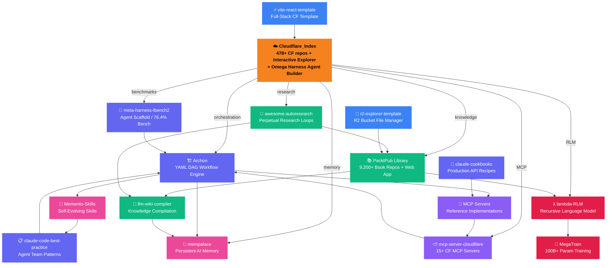

# 🗺️ SpiralCloudOmega Ecosystem Map

> A visual guide to all interconnected repositories forming the Omega Harness multi-agent architecture.

---

## Full Ecosystem Diagram

---

## Repository Inventory

### 🔥 Core (1 repo)

| Repository | Description | Tech Stack | Live |
|-----------|-------------|-----------|------|
| [Cloudflare_Index](https://github.com/SpiralCloudOmega/Cloudflare_Index) | Index of 478+ Cloudflare repos + Interactive Explorer + Omega Harness Agent Builder with 61+ node types and 7 workflow templates | Vite + React + TypeScript + React Flow | [🌐 Open](https://SpiralCloudOmega.github.io/Cloudflare_Index/) |

### 🚀 Agent Layer (4 repos)

| Repository | Description | Tech Stack |
|-----------|-------------|-----------|
| [Archon](https://github.com/SpiralCloudOmega/Archon) | YAML DAG workflow orchestration engine — define agent pipelines as declarative YAML | TypeScript / Bun |
| [meta-harness-tbench2-artifact](https://github.com/SpiralCloudOmega/meta-harness-tbench2-artifact) | Terminal-Bench agent scaffold achieving 76.4% benchmark score | Python |
| [claude-code-best-practice](https://github.com/SpiralCloudOmega/claude-code-best-practice) | Agent team orchestration patterns, coding standards, and prompt architecture | Markdown |
| [claude-cookbooks](https://github.com/SpiralCloudOmega/claude-cookbooks) | Production-ready Claude API recipes for common agent tasks | Python / TypeScript |

### 🏰 Memory Layer (2 repos)

| Repository | Description | Tech Stack |
|-----------|-------------|-----------|
| [mempalace](https://github.com/SpiralCloudOmega/mempalace) | Persistent AI memory system using spatial organization + vector search | Python |
| [Memento-Skills](https://github.com/SpiralCloudOmega/Memento-Skills) | Self-evolving agent skills with Read→Execute→Reflect→Write loop | Python |

### 📚 Knowledge Layer (3 repos)

| Repository | Description | Tech Stack |
|-----------|-------------|-----------|
| [PACKTPub_The_Digital_Library_Of_Alexandria](https://github.com/SpiralCloudOmega/PACKTPub_The_Digital_Library_Of_Alexandria) | 9,200+ PacktPublishing repos + document management web app + upload tools | HTML/JS + Python |
| [llm-wiki-compiler](https://github.com/SpiralCloudOmega/llm-wiki-compiler) | Incremental knowledge compilation into interlinked wikis with `[[wikilinks]]` | TypeScript |
| [awesome-autoresearch](https://github.com/SpiralCloudOmega/awesome-autoresearch) | Karpathy-inspired perpetual research loop patterns and configurations | Markdown |

### 🤖 Protocol Layer (2 repos)

| Repository | Description | Tech Stack |
|-----------|-------------|-----------|
| [servers](https://github.com/SpiralCloudOmega/servers) | Model Context Protocol (MCP) reference server implementations | TypeScript |
| [mcp-server-cloudflare](https://github.com/SpiralCloudOmega/mcp-server-cloudflare) | 15+ domain-specific Cloudflare MCP tool servers (KV, R2, D1, AI, etc.) | TypeScript |

### λ Training Layer (2 repos)

| Repository | Description | Tech Stack |
|-----------|-------------|-----------|
| [lambda-RLM](https://github.com/SpiralCloudOmega/lambda-RLM) | λ-calculus recursive language model with SPLIT/MAP/REDUCE typed operators | Python |
| [MegaTrain](https://github.com/SpiralCloudOmega/MegaTrain) | 100B+ parameter model training on single GPU via double-buffering + gradient checkpointing | Python |

### ⚡ Template Layer (2 repos)

| Repository | Description | Tech Stack |
|-----------|-------------|-----------|
| [vite-react-template](https://github.com/SpiralCloudOmega/vite-react-template) | Vite + React + Hono + Workers full-stack Cloudflare template | TypeScript |
| [r2-explorer-template](https://github.com/SpiralCloudOmega/r2-explorer-template) | Google Drive-style UI for Cloudflare R2 buckets | TypeScript |

---

## Connection Map

Each arrow below represents a data flow or integration dependency:

| From → To | Integration Type | Description |
|-----------|-----------------|-------------|
| Cloudflare_Index → Archon | Orchestration | Agent builder exports workflows as Archon YAML DAGs |
| Cloudflare_Index → meta-harness | Benchmarks | Agent benchmark results displayed in builder |
| Cloudflare_Index → mempalace | Memory | Builder workflows use MemPalace nodes for persistence |
| Cloudflare_Index → PacktPub | Knowledge | PacktPub search & ingest nodes in workflow builder |
| Cloudflare_Index → mcp-server-cloudflare | MCP | MCP server nodes connect to 15+ CF tools |
| Cloudflare_Index → lambda-RLM | RLM | Recursive decomposition workflow template |
| Cloudflare_Index → awesome-autoresearch | Research | Autoresearch loop workflow template |
| Archon → mempalace | Memory | Archon workflows store/recall from MemPalace |
| Archon → Memento-Skills | Skills | Archon routes tasks to skill executor |
| Archon → MCP Servers | Protocol | Archon calls MCP tools for external capabilities |
| meta-harness → Archon | Scaffold | Harness uses Archon for workflow orchestration |
| claude-code-best-practice → Archon | Patterns | Agent team patterns encoded as Archon configurations |
| claude-cookbooks → MCP Servers | Recipes | API recipes exposed as MCP tools |
| PacktPub → llm-wiki-compiler | Knowledge | Book repos compiled into interlinked wikis |
| llm-wiki-compiler → mempalace | Memory | Compiled wiki stored as spatial memories |
| awesome-autoresearch → llm-wiki-compiler | Research | Research results compiled into wiki pages |
| awesome-autoresearch → PacktPub | Discovery | Research gaps → search PacktPub for relevant books |
| MCP Servers → mcp-server-cloudflare | Protocol | Reference impls include CF-specific servers |
| mcp-server-cloudflare → Archon | Tools | CF MCP tools available in Archon workflows |
| lambda-RLM → MegaTrain | Training | RLM decompositions feed training pipelines |
| PacktPub → lambda-RLM | Data | Book content decomposed recursively by RLM |
| vite-react-template → Cloudflare_Index | Foundation | Index site built on this template |
| r2-explorer-template → PacktPub | Storage | R2 explorer for PacktPub document buckets |
| Memento-Skills → claude-code-best-practice | Patterns | Skill evolution follows best practice patterns |

---

## Stats Summary

| Metric | Value |
|--------|-------|
| **Total repositories** | 16 |
| **Total indexed repos** | 9,700+ (478 Cloudflare + 9,200+ PacktPub) |
| **Interconnections** | 24 |
| **Categories** | 7 (Core, Agent, Memory, Knowledge, Protocol, Training, Template) |
| **Node types (builder)** | 61+ |
| **Workflow templates** | 7 |
| **MCP servers** | 15+ |
| **Technology categories** | 28 (10 Cloudflare + 18 PacktPub) |

---

## Related Documents

- [Omega_Harness_Architecture.md](Omega_Harness_Architecture.md) — System architecture details
- [Digital_Library_Knowledge_Pipeline.md](Digital_Library_Knowledge_Pipeline.md) — PacktPub integration pipeline
- [MCP_Protocol_Integration.md](MCP_Protocol_Integration.md) — MCP protocol details
- [Cloudflare_Agent_Workflows.md](Cloudflare_Agent_Workflows.md) — All 7 workflow templates
- [CLOUDFLARE_ECOSYSTEM.md](CLOUDFLARE_ECOSYSTEM.md) — Cloudflare product-to-repo map
